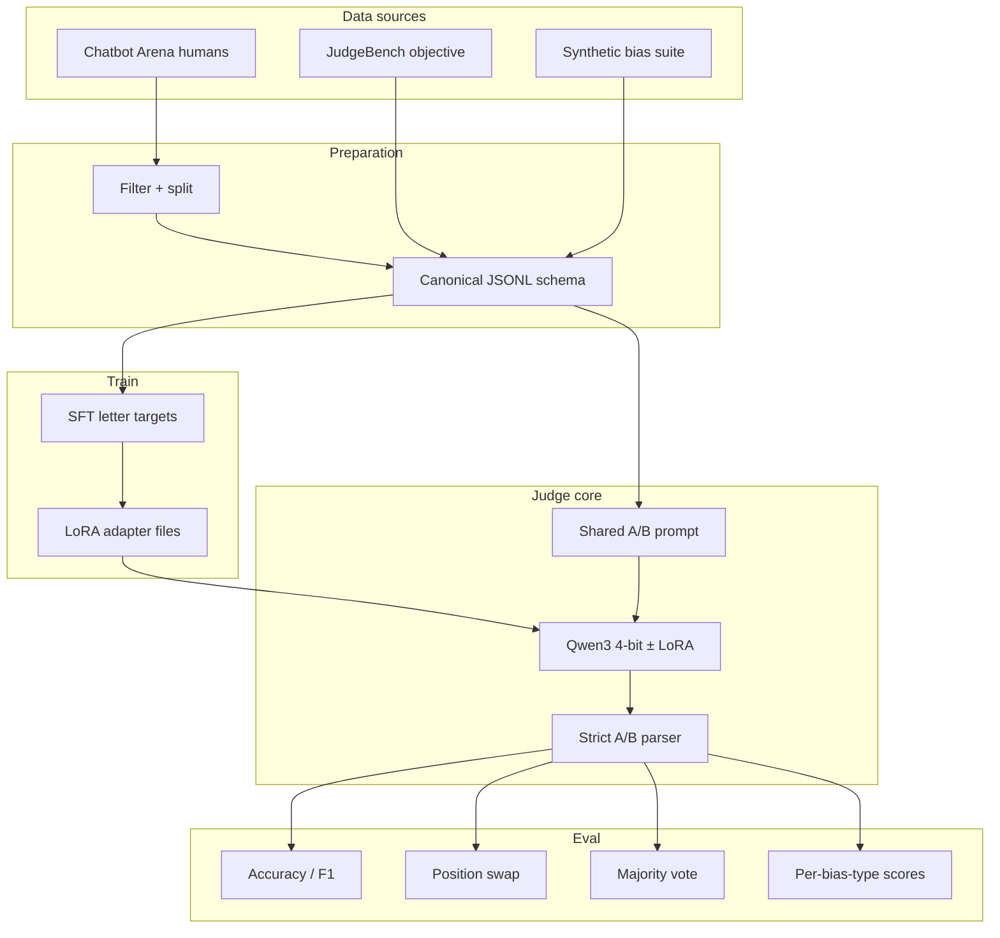

# MiniJudge Architecture

**Project:** Can a 1.7B model become a reliable LLM-as-a-Judge?  
**Hardware target:** RTX 4050 Laptop (~6 GB VRAM)  
**Stack:** Qwen3 + 4-bit QLoRA (PEFT/TRL) + local eval (no paid APIs)

---

## 1. Purpose

MiniJudge is a **local research pipeline**, not a chatbot product.

It answers:

> How much do **QLoRA fine-tuning**, **position swapping**, and **majority voting** improve the accuracy and reliability of a **1.7B** pairwise judge?

The system turns a small causal LM into an **A-vs-B referee**:

```text
Question + Response A + Response B  →  label {A, B}
```

---

## 2. High-level architecture

```text
┌─────────────────────────────────────────────────────────────────┐
│                        MiniJudge                                 │
│                                                                  │
│  configs/*.yaml  ──►  scripts/0x_*.py  ──►  src/minijudge/*     │
│                                                  │               │
│                                                  ▼               │
│                                         data/processed/*.jsonl   │
│                                                  │               │
│                          ┌───────────────────────┼────────────┐  │
│                          ▼                       ▼            ▼  │
│                     Baselines              QLoRA train     Eval  │
│                   (0.6B / 1.7B)           (1.7B adapter)  suite  │
│                          │                       │            │  │
│                          └───────────┬───────────┘────────────┘  │
│                                      ▼                           │
│                              outputs/**/metrics.json             │
│                                      │                           │
│                                      ▼                           │
│                         dashboard.html + RESULTS.md              │
└─────────────────────────────────────────────────────────────────┘
```

### Data / control flow



---

## 3. Canonical example schema

Every dataset is normalized to:

```json
{
  "id": "string",
  "source": "chatbot_arena | judgebench | bias_suite",
  "question": "...",
  "response_a": "...",
  "response_b": "...",
  "label": "A | B",
  "bias_type": "optional for bias suite"
}
```

This single contract lets train, baseline, reliability eval, and bias eval share one inference path.

---

## 4. Components

### 4.1 Data layer — `src/minijudge/data/`

| Module | Role |
|---|---|
| `arena.py` | Load LMSYS Chatbot Arena; keep English, single-turn, clear winners, no ties; write train/val/test |
| `judgebench.py` | Load JudgeBench (or builtin seed fallback); **eval only, never train** |
| `bias_suite.py` | Synthesize 6×25=150 trap pairs locally |

**Splits (Arena):**

| File | N | Use |
|---|---:|---|
| `arena_train.jsonl` | 3000 | QLoRA SFT |
| `arena_val.jsonl` | 400 | Train-time loss monitor |
| `arena_test.jsonl` | 600 | Held-out human preference test |
| `arena_smoke_train.jsonl` | 500 | Pipeline / VRAM check |
| `bias_suite.jsonl` | 150 | Controlled robustness test |
| `judgebench.jsonl` | varies | External objective test |

### 4.2 Prompt + parse — `prompts.py`, `parser.py`

**Prompt (v1):** ask only for `A` or `B` (no rationales).

Criteria mentioned to the model:

1. Correctness  
2. Relevance  
3. Clarity  
4. Completeness  

**Parser:** maps free text → `{A, B, invalid}`. Invalid rate is a first-class metric because a judge that cannot emit a label is useless.

### 4.3 Model layer — `models/`

- Load `Qwen/Qwen3-0.6B` or `Qwen/Qwen3-1.7B` in **4-bit NF4**
- Optionally attach PEFT LoRA adapter from `outputs/qlora_1.7b/`
- Inference uses chat template with `enable_thinking=False` (Qwen3)

### 4.4 Training — `train/` (QLoRA)

```text
Frozen 4-bit base weights
  + trainable LoRA on q/k/v/o + gate/up/down
  → SFT target: assistant content = "A" or "B"
```

Typical full run:

| Knob | Value |
|---|---|
| Model | Qwen3-1.7B |
| LoRA rank / alpha | 16 / 32 |
| Max seq length | 768 |
| Batch × accum | 1 × 8 |
| Epochs | 2 |
| Precision | bf16 (auto on RTX 40-series) |
| Observed peak VRAM | ~3.22 GB |
| Trainable params | ~17.4M (~1%) |

Backend: **PEFT + TRL** by default (Windows-friendly). Unsloth optional.

### 4.5 Evaluation — `eval/`

For each example, `judge.py` can:

1. **Normal order** A vs B  
2. **Swapped order** B vs A, then invert the label back  
3. **Majority-at-K** (optional temperature sampling)

Metrics (`metrics.py`):

| Metric | Meaning |
|---|---|
| Accuracy | Match gold A/B |
| Macro F1 | Balanced class quality |
| Position consistency | Same winner after swap |
| Conflict rate | Winner flips after swap |
| Invalid-output rate | Not parseable as A/B |
| Latency / peak VRAM | Practicality |

### 4.6 Orchestration — `scripts/` + `configs/`

| Script | Stage |
|---|---|
| `01_prepare_data.py` | Build JSONL |
| `01a_check_arena_access.py` | HF auth smoke test |
| `02_run_baseline.py` | Prompt-only judges |
| `03_train_qlora.py` | Fine-tune |
| `04_evaluate.py` | QLoRA / reliability eval |
| `05_bias_suite_eval.py` | Bias traps (+ base compare) |
| `06_plot_loss.py` | Train curve |
| `07_build_dashboard.py` | Aggregate HTML dashboard |

YAML configs own experiment differences (model, adapter, swap, votes). Scripts stay thin.

---

## 5. Experiment matrix

| Config | Train? | Swap | Vote | Question it answers |
|---|---|---|---|---|
| 0.6B prompt-only | No | Yes | No | Tiny ceiling |
| 1.7B prompt-only | No | Yes | No | Main baseline |
| 1.7B QLoRA + swap | Yes | Yes | No | Does fine-tuning help? |
| 1.7B QLoRA + swap + vote | Yes | Yes | Yes | Do reliability tricks help more? |

**Test surfaces:**

| Surface | Kind | Trained on? |
|---|---|---|
| Chatbot Arena test | Real human preferences | No (held-out) |
| Synthetic bias suite | Homemade traps | No |
| JudgeBench | Objective hard pairs | No |

---

## 6. Synthetic bias suite (detail)

Built in code (`bias_suite.py`), not scraped.

| Type | Trap |
|---|---|
| Position | Correct answer placed second; tests always-pick-A |
| Length | Short correct vs long wrong |
| Citation | Fake “paper/WHO” authority on wrong answer |
| Formatting | Plain correct vs pretty markdown wrong |
| Majority opinion | “Most people say …” on wrong answer |
| Irrelevant padding | Wrong answer + fluent unrelated text |

6 types × 25 items = **150** examples.

---

## 7. JudgeBench (detail)

External challenge set for **objective correctness** (knowledge / reasoning / math / coding).

- Used **only at evaluation**
- If HF dataset is unavailable, pipeline writes a tiny **seed** set so scripts still run
- Seed scores must **not** be reported as real JudgeBench results

---

## 8. Inference path (one comparison)

```text
1. build_chat_messages(question, A, B)
2. tokenizer.apply_chat_template(..., enable_thinking=False)
3. model.generate(max_new_tokens=8)
4. parse_ab_label(raw_text) → A | B | invalid
5. optional: swap responses, invert label, compare consistency
6. optional: repeat K times, majority_vote
```

---

## 9. Artifact layout

```text
data/processed/          # inputs (JSONL)
outputs/
  baseline_0.6b/         # metrics + predictions
  baseline_1.7b/
  qlora_1.7b/            # LoRA adapter + train_metrics.json
  eval_qlora/
  eval_qlora_reliability/
  eval_bias/             # fine-tuned bias metrics
  eval_bias/base/        # prompt-only bias metrics
  dashboard.html         # local aggregate UI
  dashboard_data.json
```

---

## 10. Design principles

1. **One schema, one prompt, one parser** across all experiments  
2. **Measure reliability**, not only accuracy (swap / conflict)  
3. **Fit consumer GPU** (4-bit + LoRA + short sequences)  
4. **No paid teachers** in v1  
5. **Classification first**; rationales / RL / UI later  

---

## 11. Out of scope (v1)

- 7B fine-tuning on 6 GB  
- GPT-4 / Claude labels  
- A/B/TIE three-class  
- Rationale / CoT targets  
- DPO / RL as first method  
- Gradio product UI  
- Large multi-benchmark suites  

---

## 12. Related docs

- `README.md` — quick start  
- `STEPS.md` — week-by-week runbook  
- `RESULTS.md` — filled metrics table  
- Cursor canvas: `minijudge-results.canvas.tsx` — visual results summary  
